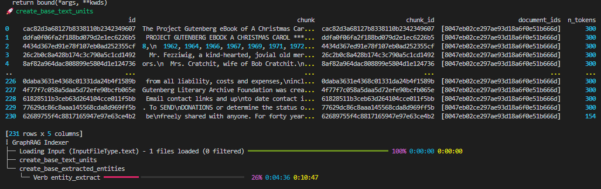

# GraphRAG Installation and Setup Guide

## 1. Install GraphRAG

Run the following command to install GraphRAG via pip:
```bash
pip install graphrag
```

## 2. Create 'input' folder where the initial data for testing will be stored
## 3. Add data (in this case book.txt)
## 4. Setup workspace vars
```bash
    python -m graphrag.index --init --root ./
```

For the .env template you can take the [official .env](https://microsoft.github.io/graphrag/posts/config/template/) from Microsoft

## 5. Adjust settings.yaml accordingly. 

Overview of all variables [here](https://microsoft.github.io/graphrag/posts/config/json_yaml/).
For customization of other services & LLMs, check out the [env vars reference from Microsoft](https://github.com/microsoft/graphrag/blob/main/docsite/posts/config/env_vars.md)


## 6. Run the indexing pipeline

```bash
    python -m graphrag.index --root ./
```



# 7. Run global query

Global search method generates answers by searching over all AI-generated community reports in a map-reduce fashion. This is a resource-intensive method, but often gives good responses for questions that require an understanding of the dataset as a whole.

For running on the global level:
```bash
python -m graphrag.query --root ./ --method global "What are the top themes in the story?"
```

Alternatively query can be run via the **search.ipynb notebook** in the 7-graphrag directory.

# 8. Run local query

Local search method generates answers by combining relevant data from the AI-extracted knowledge-graph with text chunks of the raw documents. This method is suitable for questions that require an understanding of specific entities mentioned in the documents (e.g. What are the healing properties of chamomile?)

For running on the local level:
```bash
python -m graphrag.query --root ./ --method local "Main negative traits of character of Cratchit family"
```


